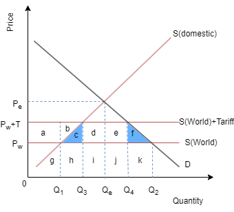
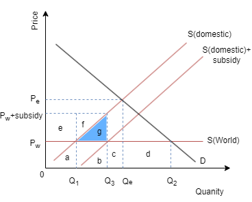
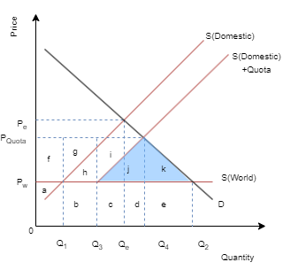

#### **Free trade**
Free trade takes place between countries when there are no barriers to trade in place, established by the government or international organisations.

#### **Arguments for protectionism**

1. **Protecting domestic employment**: In the economy there will be industries that are in decline(sunset industries), due to inability to compete with foreign firms. Governments may attempt to protect these industries by introducing protectionist measures.
2. **Protecting the economy from low-cost labour**: Unemployment may occur if the low cost labour from foreign importers. This may however go against the idea of comparative advantage.
3. **Protecting an infant (sunrise) industry**: Governments may impose protectionist measures to protect newly developing industries which are not competitive enough. These sunrise industries do not yet possess economies of scale which causes them to be less competitive.
4. **To avoid risks of over-specialisation**: Governments may attempt to limit over-specialisation to avoid dependence on exports of one or two products. This lack of diversification leads to an increased risk if the world markets for these products would change.
5. **Strategic reasons**: Some argue that certain industries should be protected in case of war.
6. **To prevent dumping**: Dumping refers to a practice of selling large quantities of goods in a foreign market at a lower price than production costs. Dumping can severely negatively affect smaller producers of the country where the products are sold to (especially developing countries). This situation allows governments to introduce anti-dumping measures.
7. **To protect standards**: Countries may introduce health, environmental and safety standards for goods imported into their markets. This serves to ensure the quality of imported products matches the standards of the domestic ones.
8. **To raise government revenue**: Taxation on imports (tariffs) raise government revenue.
9. **To correct a balance of payments deficit**.

#### **Arguments against protectionism**

1. Protectionism may raise prices to consumers and producers.
2. Less choice for consumers.
3. Less competition if foreign firms are kept away. This may create inefficiencies if domestic producers do not have the incentive to minimise costs along with lower export competitiveness.
4. Distorted comparative advantage leading to inefficient allocation of resources and lower world output.
5. Protectionism may prompt retaliation from other countries.
6. These disadvantages may overall hinder economic growth.

#### **Main types of protectionism**

**Tariffs**, which are taxes imposed on imported goods. They are the most common anti-dumping measure as they can eliminate the cost advantage of importers.

How do the tariffs work then? Essentially upon the imposition of a tariff the supply curve shifts upwards but the amount of tax. The shift would refer to the world supply curve as tariffs affect the foreign producers. Of course this shift would lead to a rise in price (Pw to Pw+Tariff). As the law of demand states this will also affect demand negatively. An issue that may appear is loss of consumer surplus as the demand has fallen. This is called dead-weight loss of welfare.

**Subsidies** essentially defined as the amount of money paid by the government to a firm, per a unit of income, thus lowering the firm's costs. This action helps the firms become more competitive.

How do the subsidies work? They shift the domestic supply diagram downwards by the amount of the subsidy hence giving the domestic producers an opportunity to increase production from Q1 to Q1Q3. This means that foreign firms now produce a lesser quantity of Q2Q3 and their revenue falls(from b+c+d to c+d).

The government will pay the subsidy in the form of the revenue boxes e+f+g. The government will face opportunity cost as they will face reduced government spending on other areas.

Once again an issue of inefficiency can occur. The more efficient foreign producers require minimum revenue of g while the domestic firms need b+g, representing this inefficiency. This is another dead-weight loss of welfare.

It has to be noted that consumers are indirectly affected by the subsidies as governments use tax revenue to fund subsidies. Potentially higher taxes could be imposed.

**Quotas**, that are physical limits on the number or value of goods that can be imported into a country.

How do quotas work? As the quota is imposed on Q1Q3 units the domestic suppliers will produce at the same level yet the foreign producers will provide less units hence generating excess demand(Q3Q2). As a result prices would rise giving the domestic producers a chance to increase their revenue by ΔPquotaPw as the higher prices incentives them to enter the market. As the domestic suppliers earn more the foreign firms will lose revenue (from b+c+d+e to b+g+h).

Point k shows loss of consumer surplus and point j illustrates loss of efficiency hence indicating dead-weight loss of welfare.

Administrative barriers:
- Red tape refers to excessive bureaucratic procedures andregulations established to restrict imports.
- Health, safety, and environmental standards.
- Embargoes, which are known as extreme quotas. This measureinvolves a complete ban on imports and is usually meant aspolitical punishment.

#### **Exercises essay type questions**
- Discuss the impact of protectionist policies on global trade and economic development.
- Evaluate the effectiveness of protectionism in achieving economic objectives such as promoting domestic employment and industrial growth.
- Examine the impact of protectionism on consumer welfare and choice in the global marketplace.
- Evaluate the effectiveness of tariffs as a tool for protecting domestic industries from foreign competition.
