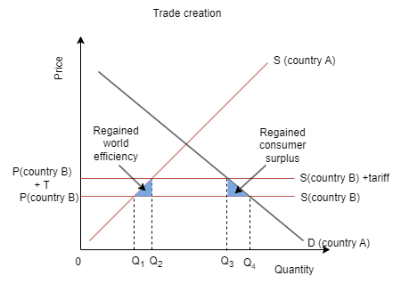
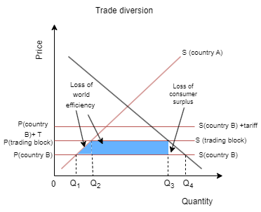

Countries trade to maximise their economic welfare by capitalising on comparative advantages, accessing resources, diversifying markets, and fostering economic growth and development.

#### **Trade Creation**

This occurs when a country enters into a regional trade agreement (RTA) and starts trading more with other member countries because of the removal of trade barriers within the agreement. It leads to the diversion of trade from higher-cost producers outside the agreement to lower-cost producers within the agreement. This generally results in increased efficiency and welfare gains for the participating countries.

#### **Trade Diversion**

This occurs when a country enters into an RTA and starts trading less with non-member countries due to the imposition of higher trade barriers (such as tariffs) on them compared to member countries. Trade diversion can lead to inefficiencies if the diverted trade is from a more efficient producer outside the agreement to a less efficient producer within the agreement.

These concepts are essential in analysing the impact of regional trade agreements on the allocation of resources, trade patterns, and overall economic welfare.

#### **Here are some real-life examples of trade creation and trade diversion:**
 

**Trade Creation:**

*European Union (EU)*

When countries like Spain and Portugal joined the EU, they experienced trade creation as they increased their trade with other member countries due to reduced trade barriers.

*North American Free Trade Agreement (NAFTA)*

NAFTA led to trade creation among its member countries (United States, Canada, and Mexico) as they benefited from reduced tariffs and increased trade among themselves.

**Trade Diversion:**

*European Union (EU)*

The EU has also experienced trade diversion, particularly in agricultural products. When the EU imposes higher tariffs on agricultural imports from non-member countries, it diverts trade away from more efficient producers outside the EU to less efficient producers within the EU.

*Mercosur (Southern Common Market)*

Mercosur, comprising countries like Brazil, Argentina, Paraguay, and Uruguay, has seen instances of trade diversion. When Mercosur imposes higher tariffs on goods from non-member countries, it diverts trade away from those countries to member countries, sometimes at the expense of efficiency.

#### **Essay type exercises:** 

1. Discuss the concept of trade creation and trade diversion in the context of regional trade agreements. Using real-life examples, analyse the economic effects of trade creation and diversion on member countries and non-member countries.

2. To what extent do regional trade agreements contribute to trade creation and trade diversion? Evaluate the impact of regional trade agreements on global trade patterns and economic welfare, considering both positive and negative consequences.