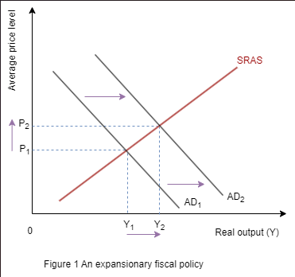
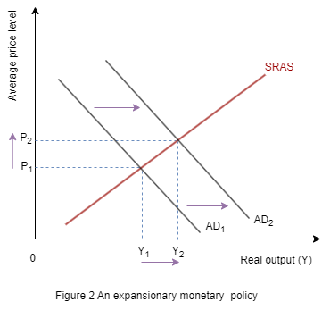

Demand management policies are macroeconomic policies implemented by governments or central banks to influence aggregate demand in an economy. These policies aim to stabilise economic fluctuations, control inflation, and promote economic growth.

**Types of Demand Management Policies:**

a. **Fiscal Policy:** Fiscal policy involves government manipulation of taxation and  government spending to influence aggregate demand.

- _Expansionary Fiscal Policy_: Implemented during economic downturns to stimulate aggregate demand. This involves decreasing taxes and/or increasing government spending.

- Contractionary Fiscal Policy: Implemented during periods of inflation or economic overheating to reduce aggregate demand. This involves increasing taxes and/or decreasing government spending.

Examples:

1.Expansionary Fiscal Policy:

- Increase in Government Spending:

The government can increase spending on infrastructure projects,education, healthcare, or defence. This stimulates aggregate demand by injecting money into the economy.

- Tax Cuts:Lowering taxes increases disposable income, encouraging consumption and investment. It can also stimulate business activity and hiring.

2.Contractionary Fiscal Policy:

- Decrease in Government Spending: Cutting spending on public projects and services reduces the amount of money flowing into the economy, which can help to control inflation or reduce budget deficits.

- Tax Hikes: Raising taxes decreases disposable income, which can lower consumer spending and investment. It can also help to reduce budget deficits by increasing government revenue.

3.Government Subsidies and Transfers:

- Subsidies:Governments can provide subsidies to specific industries or sectors to encourage production and consumption. For example, subsidies for renewable energy can promote investment in clean technologies.

- Transfers: Direct cash transfers to individuals, such as social welfare payments or stimulus checks, can boost consumer spending and support household incomes during economic downturns.

4.Infrastructure Investment: 

- Public Works Projects: Investing in infrastructure projects like roads, bridges, and public transportation creates jobs and stimulates economic activity. It also provides long-term benefits in terms of improved productivity and competitiveness.

5.Debt Management:

- Debt Repayment:Governments can use fiscal policy to allocate funds for debt repayment, reducing interest payments and freeing up resources for other priorities.

- Debt Financing: Borrowing funds through issuing bonds can finance government spending or investment projects, but it also increases the national debt and future interest obligations.

b. **Monetary Policy**:-Monetary policy involves central bank manipulation of interest rates and money supply to influence aggregate demand.

- _Expansionary Monetary Policy:_ Implemented during economic downturns to stimulate borrowing and spending. 

- Contractionary Monetary Policy: Implemented during periods of inflation to reduce borrowing and spending. This involves increasing interest rates and/or reducing the money supply.

Examples:

1.Interest Rate Targeting:

- Expansionary Monetary Policy:Central banks lower interest rates to stimulate borrowing and spending, thus increasing aggregate demand. This encourages businesses to invest and consumers to spend, which can lead to economic expansion.

- Contractionary Monetary Policy: Central banks raise interest rates to reduce borrowing and spending, thereby cooling down an overheating economy and controlling inflation. Higher interest rates make borrowing more expensive, leading to decreased investment and consumption.

2.Open Market Operations :

- Expansionary: Central banks purchase government securities (such as bonds) from banks and financial institutions. This injects money into the banking system, lowering interest rates and increasing liquidity, which stimulates lending and economic activity.

- Contractionary: Central banks sell government securities to banks and financial institutions, absorbing money from the banking system. This reduces liquidity, increases interest rates, and slows down lending and economic activity.

3.Quantitative Easing (QE):

- Expansionary QE: In times of economic crisis or when interest rates are already very low, central banks may implement QE by purchasing long-term government bonds and other securities. This increases the money supply and lowers long-term interest rates, further stimulating borrowing and investment.

- Contractionary QE: While less common, central banks can also implement reverse QE by selling assets acquired during QE programs. This reduces the money supply and increases long-term interest rates, thus dampening economic activity and inflation.

4.Reserve Requirements:

- Expansionary Reserve Policy: Central banks can reduce reserve requirements, which are the minimum amount of funds banks must hold in reserve against deposits. Lower reserve requirements increase the amount of money banks can lend, leading to increased lending and economic activity.

- Contractionary Reserve Policy: Conversely, central banks can increase reserve requirements to reduce the amount of money banks can lend, thus slowing down lending and economic activity.

6.Exchange Rate Policies:

- While primarily under the purview of fiscal policy, central banks may also intervene in currency markets to influence exchange rates. For example, buying or selling domestic currency can affect its value relative to other currencies, impacting exports, imports, and overall economic activity.

**3. Effectiveness and Limitations:**

- Effectiveness: Demand management policies can be effective in influencing aggregate demand and stabilising the economy in the short run.

- Limitations:
- Time Lag - There is often a time lag between the implementation of policies and their impact on the economy.

- Crowding Out - Expansionary fiscal policy may lead to crowding out of private investment if it results in higher interest rates.

- Policy Conflict - Fiscal and monetary policies may sometimes work against each other, leading to inefficiencies.

- Global Factors - Economic conditions in other countries can influence the effectiveness of domestic demand management policies.

 

**4. Evaluation of Policies**

- Unintended Consequences: Demand management policies may have unintended consequences, such as inflationary pressures or asset price bubbles.

- Political Constraints: Political considerations may limit the effectiveness of demand management policies, especially during periods of political instability or gridlock.

- Sustainability: Long-term sustainability of demand management policies is crucial to avoid fiscal deficits or excessive debt accumulation.

 

**5.Examples:**

- Great Recession: During the 2008 financial crisis, many governments implemented expansionary fiscal and monetary policies to stimulate demand and prevent a deep recession.

- COVID-19 Pandemic: In response to the economic impacts of the COVID-19 pandemic, governments worldwide implemented massive fiscal stimulus packages and central banks pursued aggressive monetary easing to support aggregate demand and prevent a prolonged recession.

