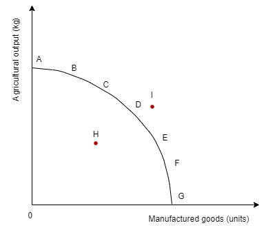
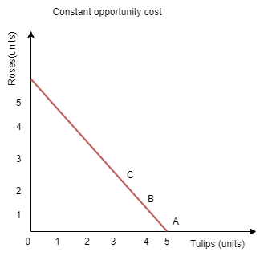
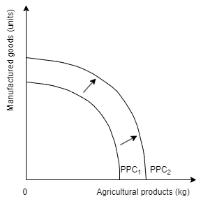
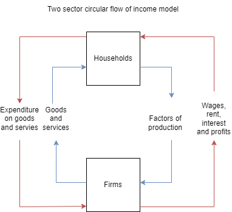
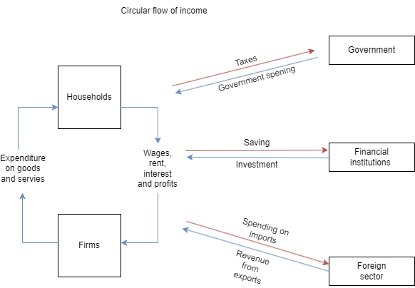

Economics is a social science that studies how people interact with each other in society to overcome the problems that arise due to the basic problem of scarcity.

#### **Microeconomics vs Macroeconomics** 

Microeconomics focuses on the interactions between smaller economic agents, such as consumers and producers, within individual markets. It examines consumer welfare and producer efficiency, as well as government intervention and producer competitiveness within specific markets.

Macroeconomics, on the other hand, deals with the broader economy, including issues like economic growth, income distribution, and challenges such as inflation and unemployment. It also examines the impact of policy tools like taxation and interest rates on the economy as a whole.

#### **The issues of scarcity and opportunity cost.**

Scarcity is a major issue in the world that stems from the conflict between finite resources and infinite material needs and wants. Hence within the economy all stakeholders make choices in regards to resource allocation. All decisions that economic agents make require a sacrifice thus leading to a concept known as opportunity cost.

_Opportunity cost refers to the value of the alternative that is foregone when a particular economic decision is taken. It may also be called a trade-off._

Considering that scarcity is an issue the value of sustainable resource allocation rises. It means that they must be managed in a way that does not threaten the future generation’s ability to use the same things.

The key is to consider the matter of efficiency in the economy. The finite resources need to be managed in a way that maximises production (highest output achievable) and minimises waste.

**The basic economic problems:**

What to produce and in what amounts?
How to produce it?
For whom is it produced?

**Factors of production:**

Land-all resources provided by nature
Labour
Capital- physical such as factories,buildings,machines, infrastructure, When firms spend money on capital we call it investment.
Entrepreneurship (management)

#### **Positive vs Normative economics**

Positive economics involves describing and analysing economic relationships through objective and factual statements, relying on logic and empirical evidence.

Normative economics, in contrast, involves subjective value judgments about how things ought to be. (opinion based)

#### **Production possibilities curve the PPC  (also known as production possibilities frontier)**

The diagram represents the maximum combination of two types of output that can be produced in an economy at a given time period.

PPC assumptions:
The economy produces only two goods at a time
The state of resources and technology is fixed
All resources are fully employed

This model illustrates issues of: scarcity, choice, opportunity cost and efficiency

Point H shows unemployment of resources or their inefficient use. The points beneath PPC are possible but showcase inefficiency. A movement H towards the PPC curve portrays actual economic growth.

Point I illustrates what is impossible due to the lack of factors of production.

The PPC showcases a hypothetical economical situation of what could be produced. The presented economy operates with productive efficiency .This in reality could lead to a lack of sustainable resource management due to the rate or their extraction. This strategy endangers economic well being.

#### **Why is the PPC concave?**

The PPC is concave because of the concept of increasing opportunity costs. In an economy with finite resources, producing more of one good means sacrificing the production of another. As you move along the PPC, producing more of one good requires sacrificing increasing amounts of the other good. This reflects the idea of diminishing marginal returns.

Therefore, the concavity of the PPC reflects the idea that resources are not perfectly adaptable and that there are diminishing returns and increasing opportunity costs associated with reallocating resources between different goods or activities.

A straight line PPC would portray constant opportunity cost where each additional unit of manufactured goods would cost the same amount of the other product.

Concave PPC is increasing opportunity cost while straight line PPC means that the opportunity cost is constant.

##### **Growth in production possibilities**

If there is an improvement in the quality or quantity of factors of production, or technological advancement then the PPC would shift outwards indicating production possibility growth.

The opposite may also happen where the PPC would shift to the left as a consequence of a reduction of quantity or quality of factors of production. The cause may be wars, epidemics or natural disasters.

#### **Circular flow of income model**

The circular flow of income model is a simplified representation of how money flows through an economy between households and firms (businesses). It illustrates the interdependence of households and firms in an economy and how they interact through the exchange of goods, services, and payments. Here's a breakdown of the key components of the model:

Households: Households are the consumers in the economy. They own the factors of production (such as labour, land, and capital) and supply them to firms in exchange for income. Households spend their income on goods and services produced by firms.

Firms (Businesses): Firms are the producers in the economy. They hire factors of production from households and use them to produce goods and services. Firms then sell these goods and services to households, generating revenue.

Factors of Production: These are the resources used in the production process, including labour, land, capital, and entrepreneurship. Households supply factors of production to firms in exchange for income (wages, rent, interest, and profit).

Goods and Services Market: This is where the exchange of goods and services takes place between households and firms. Firms supply goods and services to households, and households demand and purchase these goods and services.

Factor Market: This is where the exchange of factors of production occurs between households and firms. Households supply factors of production to firms, and firms pay households for the use of these factors.

The circular flow of income model shows how income flows from firms to households in the form of wages, rent, interest, and profit, and how spending flows from households to firms for goods and services. The model also demonstrates how this cycle of production, income, and spending continues, creating a continuous flow of goods and services and income throughout the economy.

It's important to note that this model is a simplification and doesn't account for government intervention, international trade, financial markets, and other complexities of a real-world economy. However, it provides a useful framework for understanding the basic interactions between households and firms in a closed economy.

The model can be expanded to include three more sectors: the government, financial sector and the foreign sector as shown on the diagram below

Government Sector: The government sector includes all levels of government (local, state, and federal). The government collects taxes from households and firms and provides goods and services such as infrastructure, education, healthcare, and defence. Government spending and taxation affect the level of aggregate demand and influence economic activity.

Foreign Sector: The foreign sector represents economic transactions with other countries. It includes exports (goods and services sold to other countries) and imports (goods and services purchased from other countries). Net exports (exports minus imports) contribute to or detract from a country's aggregate demand and can affect its economic growth and trade balance.

Financial Markets: The expanded model may also incorporate financial markets, where households, firms, and the government borrow and lend funds. Financial markets facilitate investment in physical capital and provide a mechanism for saving and borrowing.

In the context of the circular flow of income model or the expanded income model, "leakages" and "inflows" refer to different aspects of the flow of funds within the economy:

Types of leakages: Taxes, savings, spending on imports

Types of inflows: Government spending, investments, revenue from exports

In summary, leakages represent withdrawals or diversions of funds from the circular flow of income, while inflows represent injections or additions of funds into the circular flow. The balance between leakages and inflows influences the level of economic activity, aggregate demand, and the overall functioning of the economy.

Governments may spend more than they earn through borrowing hence running a budget deficit.

#### **Planned vs free economy**

Free market, command economy, and mixed economy are three different economic systems, each characterised by distinct features in terms of ownership, resource allocation, and government intervention. Here's an overview of each:

1. Free Market Economy:
   - In a free market economy, also known as capitalism or laissez-faire economics, economic decisions are primarily made by individuals and businesses.
   - Private ownership of resources and means of production is emphasised, and individuals are free to pursue their own self-interests.
   - Prices are determined by supply and demand forces in competitive markets, without significant government intervention.
   - The role of government is limited to protecting property rights, enforcing contracts, and ensuring competition.
   - Examples of countries with predominantly free market economies include the United States, Singapore, and Hong Kong.

2. Command Economy:
   - In a command economy, also known as socialism or communism, economic decisions are centrally planned and controlled by the government.
   - The government owns or controls the means of production and allocates resources according to central planning objectives.
   - Prices are often set by the government, rather than determined by market forces.
   - The government typically regulates production, distribution, and consumption, and may prioritise social welfare goals over individual preferences.
   - Examples of historical command economies include the former Soviet Union, China under Mao Zedong, and North Korea.

3. Mixed Economy:
   - A mixed economy combines elements of both free market and command economies.
   - In a mixed economy, there is private ownership of resources and businesses, allowing for market forces to determine prices and allocate resources efficiently in some sectors.
   - However, the government also intervenes in the economy to provide public goods, regulate certain industries, address market failures, and promote social welfare goals.
   - The extent of government intervention varies widely among mixed economies, ranging from minimal intervention (closer to a free market) to significant intervention (closer to a command economy).
   - Many modern economies, including those of most Western countries, are considered mixed economies. Examples include the United States, Canada, and most European countries.

In summary, free market, command, and mixed economies represent different approaches to organising economic activity, with varying degrees of government intervention and control. Each system has its own strengths and weaknesses, and the choice of economic system often depends on historical, cultural, and political factors.